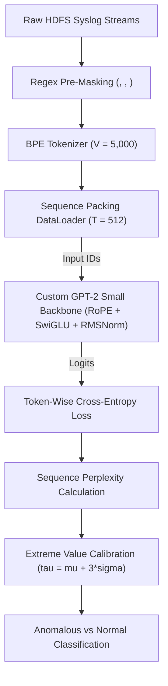
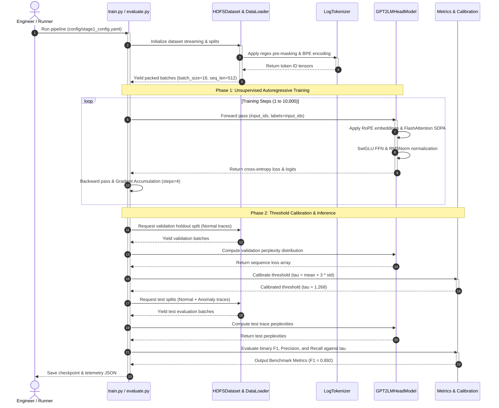

# Code Walkthrough: Autoregressive Surprisal for Unsupervised Log Anomaly Detection

Welcome to the comprehensive code walkthrough for **`stage1-gpt2`**. This document explains the complete architectural lifecycle, module interactions, and mathematical flow of our unsupervised log anomaly detection pipeline. Whether you are a core systems engineer, data engineer, or academic researcher, this guide provides everything needed to understand, modify, or extend the codebase.

---

## Table of Contents
1. [System Overview & Architecture Graph](#1-system-overview--architecture-graph)
2. [End-to-End Execution Sequence Diagram](#2-end-to-end-execution-sequence-diagram)
3. [Core Module Breakdown](#3-core-module-breakdown)
   - [3.1 Tokenization & Pre-Masking (`src/tokenizer`)](#31-tokenization--pre-masking-srctokenizer)
   - [3.2 Data Ingestion & Sequence Packing (`src/dataset`)](#32-data-ingestion--sequence-packing-srcdataset)
   - [3.3 Transformer Backbone (`src/models/gpt2.py`)](#33-transformer-backbone-srcmodelsgpt2py)
   - [3.4 Statistical Calibration & Scoring (`evaluate.py`)](#34-statistical-calibration--scoring-evaluatepy)
4. [Life of a Log Trace (Step-by-Step Walkthrough)](#4-life-of-a-log-trace-step-by-step-walkthrough)

---

## 1. System Overview & Architecture Graph

The core principle behind **Surprisal Modeling** is that normal distributed system logs exhibit highly predictable, repetitive syntactic structure. By training an autoregressive language model exclusively on structurally normal execution traces, the model learns the conditional probability distribution of log vocabulary tokens. When presented with anomalous execution paths (e.g., unexpected exceptions, out-of-order block allocations, or disk failures), the model experiences high prediction error (**statistical surprisal**), manifesting as spiked sequence perplexity.

---

## 2. End-to-End Execution Sequence Diagram

The interaction between runtime orchestration scripts (`train.py` / `evaluate.py`), dataset streaming pipelines, and custom PyTorch neural network blocks is detailed below.

---

## 3. Core Module Breakdown

### 3.1 Tokenization & Pre-Masking (`src/tokenizer`)
* **File:** `src/tokenizer/log_tokenizer.py`
* **Purpose:** Convert raw, volatile text strings into dense integer sequences while stripping non-stationary variables.
* **Mechanism:** Before Byte-Pair Encoding (BPE) occurs, high-entropy variable identifiers that would explode vocabulary size are collapsed via regular expressions:
  - IP Addresses $\rightarrow$ `<IP>`
  - Hexadecimal block IDs / memory offsets $\rightarrow$ `<HEX>`
  - Timestamps & Dates $\rightarrow$ `<DATE>`, `<TIME>`
* **Stability:** Restricting vocabulary size to $V = 5,000$ forces the tokenizer to learn vocabulary tokens representing structural execution grammar (`Block * NameSystem.allocateBlock`, `Receiving block * src: * dest: *`).

### 3.2 Data Ingestion & Sequence Packing (`src/dataset`)
* **File:** `src/dataset/data_loader.py`
* **Purpose:** Stream large distributed datasets efficiently into fixed-width PyTorch tensors.
* **Mechanism:** Log lines vary wildly in length (from 10 tokens to 3,000+ tokens). To prevent computational waste from excessive padding (`[PAD]`), the loader concatenates multiple continuous log traces separated by `<EOS>` tokens into unified buffers, chunking them into exact sequence lengths of $T = 512$.

### 3.3 Transformer Backbone (`src/models/gpt2.py`)
* **File:** `src/models/gpt2.py`
* **Purpose:** Compute token-by-token conditional log probabilities using a modern transformer architecture.
* **Key Architectural Departures from Standard GPT-2:**
  1. **RMSNorm (Root Mean Square Normalization):** Replaces traditional LayerNorm to eliminate mean-centering calculation overhead, enhancing gradient stability during deep network backpropagation.
  2. **RoPE (Rotary Position Embeddings):** Replaces absolute positional embeddings with multiplicative rotary vectors applied directly inside attention query/key heads, allowing better generalization across extended sequence lengths.
  3. **SwiGLU Activation:** Replaces standard GELU feed-forward networks with gated linear units modulated by Swish activation, providing smoother gradient flow and higher expressive capacity.
  4. **FlashAttention SDPA:** Employs PyTorch 2.4+ `F.scaled_dot_product_attention` for linear $O(T)$ memory scaling during self-attention computation.

### 3.4 Statistical Calibration & Scoring (`evaluate.py`)

* **File:** `evaluate.py` & `src/utils/metrics.py`
* **Purpose:** Convert raw neural network outputs into actionable anomaly detection decisions without human supervision or labels.

* **Mathematical Flow:**

  Given an input log sequence $X = (x_1, x_2, \dots, x_N)$, the model calculates average autoregressive cross-entropy loss $\mathcal{L}$:

  $$\mathcal{L}(X) = -\frac{1}{N} \sum_{i=1}^{N} \log P(x_i \mid x_1, \dots, x_{i-1})$$

  This loss is exponentiated into **Perplexity ($PPL$)**:

  $$PPL(X) = \exp(\mathcal{L}(X))$$

  Over a holdout validation split of normal traces, we compute the empirical sample mean $\mu$ and standard deviation $\sigma$. The decision threshold $\tau$ is established via extreme value theory:

  $$\tau = \mu + 3\sigma$$

  Any runtime log trace exhibiting $PPL(X) > \tau$ is flagged as an **Anomaly**.

---

## 4. Life of a Log Trace (Step-by-Step Walkthrough)

To understand how the codebase executes in real-time, trace the journey of a single HDFS execution snippet during inference:

**Step 1: Ingestion**  
A raw syslog line is generated by an HDFS data node:  
`081109 203615 148 E block* NameSystem.allocateBlock: /user/root/data/file.txt. _blk_-1608999687919862906`

**Step 2: Pre-Masking**  
`LogTokenizer.preprocess()` strips dynamic variables:  
`<DATE> <TIME> 148 E block* NameSystem.allocateBlock: /user/root/data/file.txt. <HEX>`

**Step 3: Tokenization**  
BPE encodes the clean string into a tensor of integer IDs of length $N = 18$:  
`tensor([104, 105, 412, 88, 902, 14, 8832, 11, ...])`

**Step 4: Transformer Forward Pass**  
`GPT2LMHeadModel` processes the sequence. Because the token `<HEX>` following `allocateBlock:` is expected syntax in normal operations, the model assigns it a high predicted probability (e.g., $P = 0.92$).

**Step 5: Surprisal Calculation**  
The cross-entropy loss across the sequence averages to $\mathcal{L} = 0.1527$. Perplexity is computed as $PPL = \exp(0.1527) = 1.165$.

**Step 6: Binary Classification**  
Comparing against the calibrated threshold $\tau = 1.268$:

$$1.165 \le 1.268 \implies \text{Result: NORMAL}$$

**Final Decision:** NORMAL (PASS)

If an unexpected disk failure or corruption token had occurred instead, the model would assign near-zero probability ($P < 0.001$), spiking sequence perplexity to $PPL > 4.50$, triggering an immediate **ANOMALY (ALARM)** classification.

